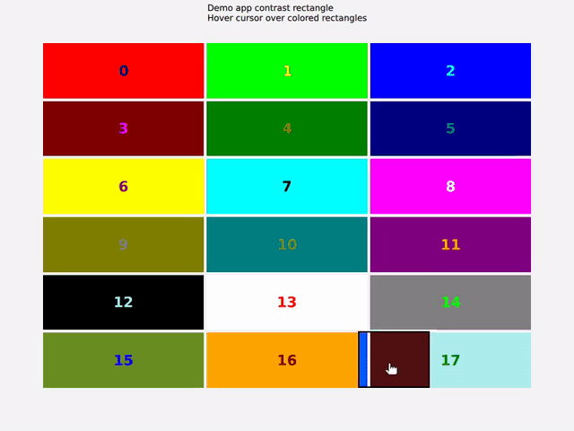

# AppContrastRectangle application project

Demo showing how to create a Rectangle that will render the underlying pixels in contrast.



See this [PR](https://github.com/ngrodzitski/qml-example-contrast-rectangle/pull/1) for details.

## Build

An example vuild command:

```bash
cmake -B_build . -DCMAKE_PREFIX_PATH=~/qt682-debug -DCMAKE_BUILD_TYPE=Debug
cmake --build _build
```
